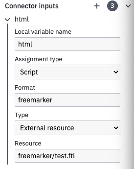
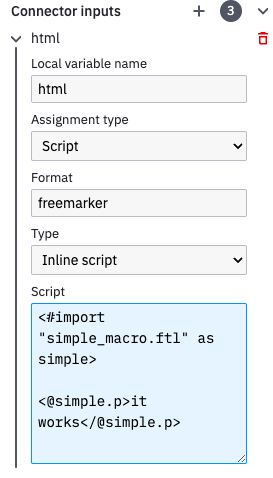

camunda-template-engines-freemarker
===============================

<p>
  <a href="https://docs.camunda.org/manual/latest/">Camunda 7 Docs</a> |
  <a href="https://forum.camunda.io/c/camunda-platform-7-topics/39">Forum</a> |
  <a href="LICENSE">License</a>
</p>

Wrapper of Java Freemarker 2.3 template engine as
[JSR 223](https://www.jcp.org/en/jsr/detail?id=223) compatible
[script engine](http://docs.oracle.com/javase/7/docs/api/javax/script/ScriptEngine.html).

You can use the template engine in Camunda Automation Platform 7 as scripting language.

## Using Freemarker templates

You can define templates and macros in order to reuse them by putting the `.ftl` files into a `templates` folder, in the Camunda classpath root (for example, if you use Camunda Run, into the `/userlib/templates` folder)

### Examples usages

- Using a macro / template in a freemarker external file :



With the following `test.ftl` content: 

```
<#import "simple_macro.ftl" as simple>

<@simple.p>it works</@simple.p>
```

- Using a macro / template in a freemarker inline script:



## More template engines (Community Extensions)

You can find the following template engine extensions in Camundas [Community Hub](https://github.com/camunda-community-hub/camunda-7-template-engines-jsr223/):

* Velocity 2.3
* xQuery Saxon 9.6
* XSLT Saxon 9.6

## Contributing

Have a look at our [contribution guide](https://github.com/camunda/camunda-bpm-platform/blob/master/CONTRIBUTING.md) for how to contribute to this repository.

## License
The source files in this repository are made available under the [Apache License Version 2.0](./LICENSE).
